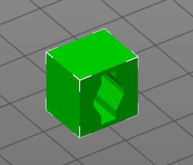

## Printing Notes
Print this sample part as shown below to most accurately represent how your printer will handle printing bearing races.

Just like the bearings, the clearances and ball size can all be adjusted from the internal spreadsheet. Remember that the bearing races may allow more flex than this test piece, since the bearing races are not joined together. To avoid having rattle in your bearing, it is better to have this test fit tightly. 
